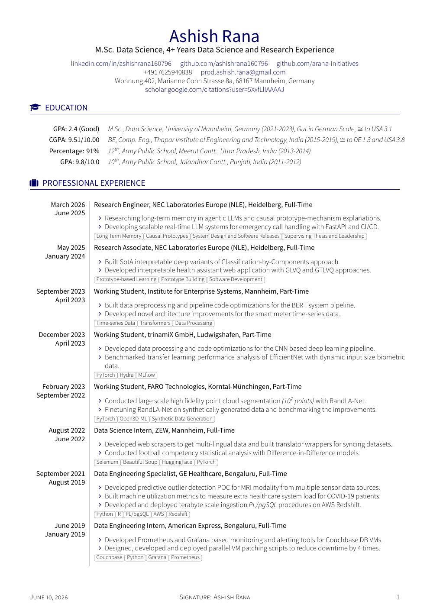
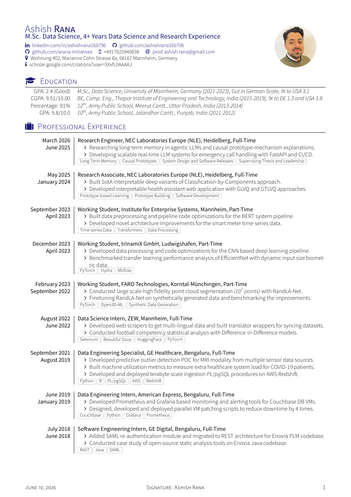
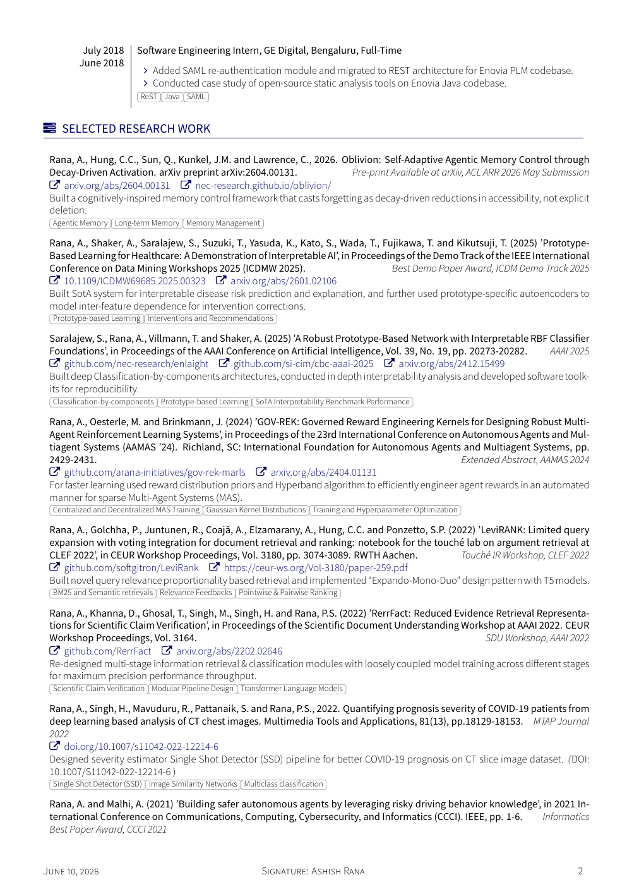
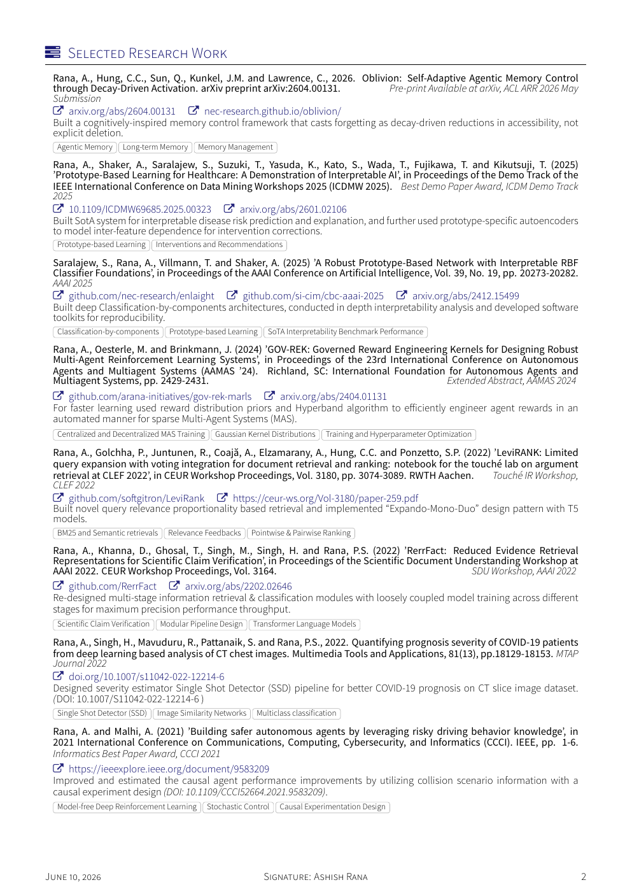
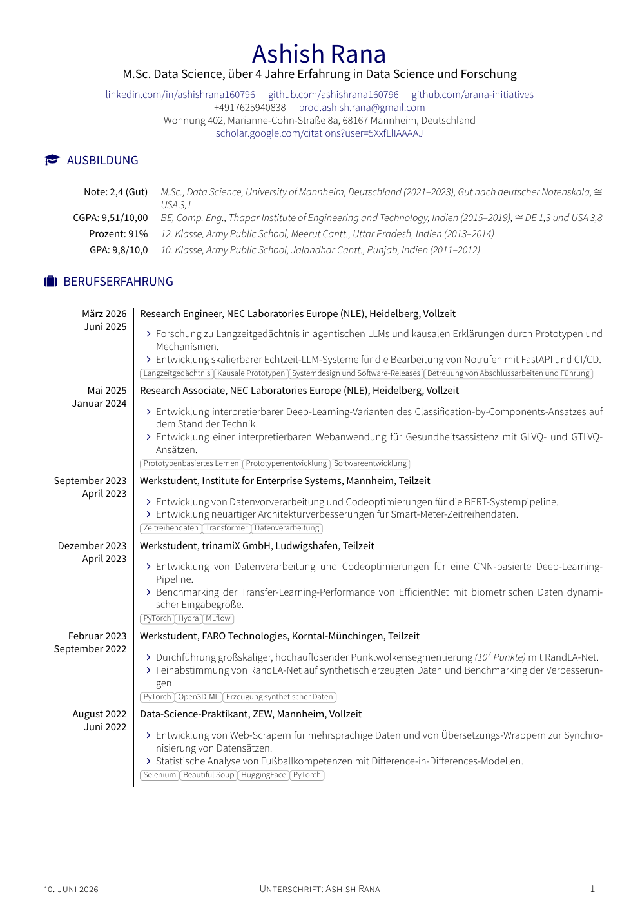
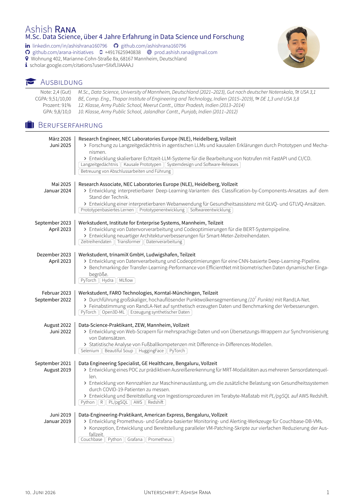
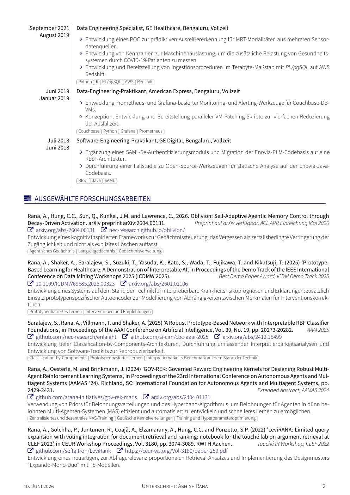
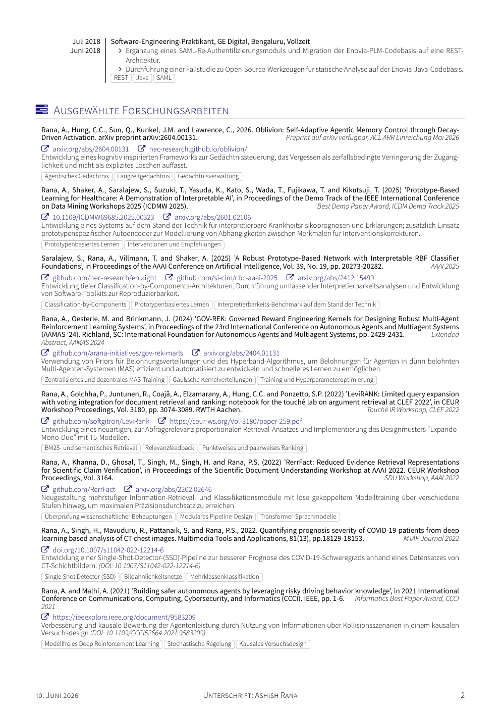

# Ashish Rana CV Templates

This repository contains four A4 LaTeX CVs built from one factual source:

- [English single-column CV](dist/ashish-rana-single-column-cv-en.pdf)
- [English dual-column CV](dist/ashish-rana-dual-column-cv-en.pdf)
- [German single-column CV](dist/ashish-rana-single-column-cv-de.pdf)
- [German dual-column CV](dist/ashish-rana-dual-column-cv-de.pdf)

The dual-column layout includes the active profile photograph. The single-column layout is text-only. Both layouts render the same active CV entries.

## English Previews

<table>
  <tr>
    <th>Single-column CV</th>
    <th>Dual-column CV</th>
  </tr>
  <tr>
    <td></td>
    <td></td>
  </tr>
  <tr>
    <td></td>
    <td></td>
  </tr>
</table>

## Deutsche Versionen

<table>
  <tr>
    <th>Einspaltiger Lebenslauf</th>
    <th>Zweispaltiger Lebenslauf</th>
  </tr>
  <tr>
    <td></td>
    <td></td>
  </tr>
  <tr>
    <td></td>
    <td></td>
  </tr>
</table>

## Project Structure

```text
dual-column-cv/
  shared/                 class, fonts, and active profile photograph
  english/                English entry point and sections
  german/                 German entry point and sections
single-column-cv/
  english/cv.tex          text-only English CV
  german/cv.tex           text-only German CV
dist/                     four generated PDFs
assets/previews/          pages 1 and 2 rendered as PNG
docs/content-validation.md
Makefile
```

The single-column entry points reuse the corresponding dual-column section files through layout-compatible commands. This keeps the active content inventory synchronized across layouts. Disabled `\iffalse` material stays in the section sources and is not rendered.

## Build Locally

### Install the tools on macOS

```bash
brew install --cask mactex-no-gui
brew install poppler
```

If the TeX commands are not found after installation, add MacTeX to your shell path:

```bash
echo 'export PATH="/Library/TeX/texbin:$PATH"' >> ~/.zshrc
source ~/.zshrc
```

Confirm the required tools:

```bash
xelatex --version
latexmk --version
pdftoppm -v
pdftotext -v
```

Then run:

```bash
make
```

### What the Makefile does

| Command | Backend behavior |
| --- | --- |
| `make` | Builds PDFs, renders previews, and runs validation. |
| `make pdfs` | Runs `latexmk` with XeLaTeX for all four entry points, writes auxiliary output under `build/`, and copies stable PDFs to `dist/`. |
| `make previews` | Uses Poppler `pdftoppm` to render pages 1 and 2 of every PDF at 120 DPI. |
| `make verify` | Checks expected files, scans LaTeX logs, extracts text with `pdftotext`, confirms active-content markers, and checks that disabled examples are absent. |
| `make clean` | Removes only the ignored `build/` directory. Committed PDFs and previews remain intact. |

## Edit And Build In Cursor

1. Install MacTeX as described above.
2. In Cursor Extensions, install **LaTeX Workshop** by James Yu.
3. Open one of the four `cv.tex` entry files.
4. Open the LaTeX Workshop command menu and choose **Build LaTeX project**.
5. Select a `latexmk (xelatex)` or XeLaTeX recipe.
6. Choose **View LaTeX PDF** to open the result in Cursor.

No repository-specific Cursor settings are required. For the complete four-document pipeline, use `make` in Cursor's integrated terminal.

If Cursor chooses pdfLaTeX, explicitly select the XeLaTeX recipe; the bundled OpenType fonts require XeLaTeX. If output appears stale, run `make clean && make`. Missing font or package errors normally indicate an incomplete MacTeX installation.

## Editing Notes

- Edit English or German section files under `dual-column-cv/<language>/sections/`.
- Header and contact information are in each layout's `cv.tex`.
- Keep equivalent active entries in English and German.
- Do not remove `\iffalse`/`\fi` around disabled examples unless they are intentionally being activated.
- Text length affects pagination in both layouts, so rebuild and inspect all pages after substantive edits.

The original factual source and permitted corrections are documented in [the validation ledger](docs/content-validation.md).

## Original Template Credits

- The single-column styling is derived from [sb2nov/resume](https://github.com/sb2nov/resume).
- The dual-column styling is derived from [darwiin/yaac-another-awesome-cv](https://github.com/darwiin/yaac-another-awesome-cv).

This repository is distributed under the [Unlicense](LICENSE). Upstream templates and bundled fonts may retain their own original terms.
